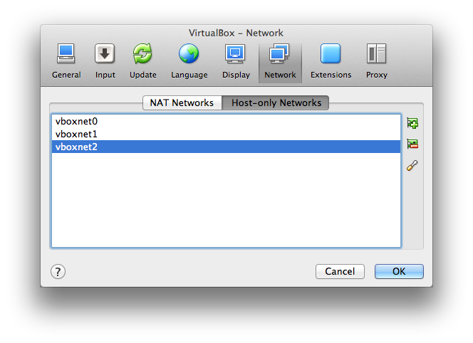
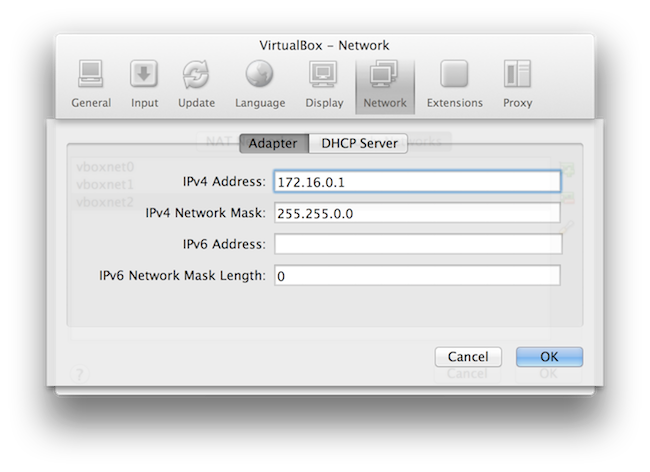
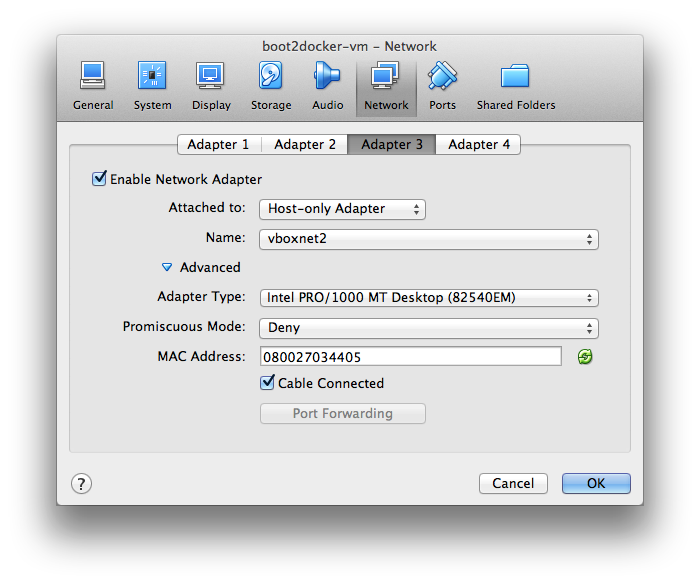

Eventuate chaos testing utilities
=================================

This is very early work in progress on chaos testing utilities for [Eventuate](https://github.com/RBMHTechnology/eventuate) and [Apache Cassandra](http://cassandra.apache.org/). They should help developers running Cassandra clusters and Eventuate applications on a single Mac OS X machine with [Docker](https://www.docker.com/) and generate failures by randomly stopping and restarting containers.

Prerequisites
-------------

### Installed Software

- [VirtualBox](https://www.virtualbox.org/wiki/Downloads) 4.3.28 or higher
- [boot2docker](http://boot2docker.io/) 1.6.2 or higher
- [sbt](http://www.scala-sbt.org/download.html) 0.13.x or higher

### Custom routing

By default, docker containers running in the boot2docker VM are not directly accessible from Mac OS. To make them accessible, packets targeted at the docker container IP addresses must be routed to the boot2docker VM. The approach taken here was inspired by the article [Accessing docker container private network easily from your boot2docker host](http://ispyker.blogspot.de/2014/04/accessing-docker-container-private.html) and has been slightly modified.

In this and the following sections, the command prompt in Mac OS terminals is:

    almdudler:~ martin$

The command prompt in terminals in the boot2docker VM is:

    docker@boot2docker:~$

The first step for setting up a custom route is the creation of a host-only network in VirtualBox. From the menu *VirtualBox -> Preferences -> Network -> Host-only Networks* create a new network which is *vboxnet2* in this example:



Edit the new network with the following settings:



The next step requires changes to the boot2docker VM settings, hence it needs to be stopped:

    almdudler:~ martin$ boot2docker stop

Right-click the *boot2docker-vm* in the VirtualBox UI and select *Settings -> Network* from the context menu. Create a new adapter (*Adapter 3* in this example) with the following settings:



Then start the boot2docker VM again:

    almdudler:~ martin$ boot2docker start
    Waiting for VM and Docker daemon to start...
    ..........ooooooooo
    Started.

Configuring *Adapter 3* in the VirtualBox UI created an `eth2` network interface in the boot2docker VM (see matching MAC address): 

    almdudler:~ martin$ boot2docker ssh
                            ##         .
                      ## ## ##        ==
                   ## ## ## ## ##    ===
               /"""""""""""""""""\___/ ===
          ~~~ {~~ ~~~~ ~~~ ~~~~ ~~~ ~ /  ===- ~~~
               \______ o           __/
                 \    \         __/
                  \____\_______/
     _                 _   ____     _            _
    | |__   ___   ___ | |_|___ \ __| | ___   ___| | _____ _ __
    | '_ \ / _ \ / _ \| __| __) / _` |/ _ \ / __| |/ / _ \ '__|
    | |_) | (_) | (_) | |_ / __/ (_| | (_) | (__|   <  __/ |
    |_.__/ \___/ \___/ \__|_____\__,_|\___/ \___|_|\_\___|_|
    Boot2Docker version 1.6.2, build master : 4534e65 - Wed May 13 21:24:28 UTC 2015
    Docker version 1.6.2, build 7c8fca2
    docker@boot2docker:~$ ifconfig eth2
    eth2      Link encap:Ethernet  HWaddr 08:00:27:03:44:05  
              inet6 addr: fe80::a00:27ff:fe03:4405/64 Scope:Link
              UP BROADCAST RUNNING MULTICAST  MTU:1500  Metric:1
              RX packets:0 errors:0 dropped:0 overruns:0 frame:0
              TX packets:32 errors:0 dropped:0 overruns:0 carrier:0
              collisions:0 txqueuelen:1000 
              RX bytes:0 (0.0 B)  TX bytes:8856 (8.6 KiB)
    
Configure this interface with the IP address `172.16.0.11` and netmask `255.255.0.0`:

    docker@boot2docker:~$ sudo ifconfig eth2 172.16.0.11
    docker@boot2docker:~$ sudo ifconfig eth2 netmask 255.255.0.0
    docker@boot2docker:~$ ifconfig eth2
    eth2      Link encap:Ethernet  HWaddr 08:00:27:03:44:05  
              inet addr:172.16.0.11  Bcast:172.16.255.255  Mask:255.255.0.0
              inet6 addr: fe80::a00:27ff:fe03:4405/64 Scope:Link
              UP BROADCAST RUNNING MULTICAST  MTU:1500  Metric:1
              RX packets:0 errors:0 dropped:0 overruns:0 frame:0
              TX packets:38 errors:0 dropped:0 overruns:0 carrier:0
              collisions:0 txqueuelen:1000 
              RX bytes:0 (0.0 B)  TX bytes:10908 (10.6 KiB)

Assuming that Docker containers have IP addresses `172.17.x.x`, the final step is adding a route to the Mac OS routing tables that routes all traffic targeted at `172.17.x.x` to `172.16.0.11`: 

    almdudler:~ martin$ sudo route -n add 172.17.0.0/16 172.16.0.11
    add net 172.17.0.0: gateway 172.16.0.11

Setting the IP address and netmask of `eth2` as well as adding the route to Mac OS must be repeated if the boot2docker VM or Mac OS is restarted, respectively. This can be automated of course but is not shown here.

Running a Cassandra cluster
---------------------------

For starting a Cassandra cluster with four nodes, run:

    almdudler:~ martin$ ./cluster-start.sh 4
    cassandra-1
    cassandra-2
    cassandra-3
    cassandra-4

If no argument is given, three nodes are started by default. Running the command for the first time downloads all required Docker images which may take a while. For stopping the cluster and removing all containers, run: 
 
    almdudler:~ martin$ ./cluster-stop.sh 
    cassandra-1
    cassandra-2
    cassandra-3
    cassandra-4

Running a Cassandra cluster with random node failures
-----------------------------------------------------

For running a cluster with random node failures, start the [`ChaosCluster`](https://github.com/RBMHTechnology/eventuate-chaos/blob/master/src/main/scala/com/rbmhtechnology/eventuate/chaos/ChaosCluster.scala) application from the sbt command prompt:

    almdudler:~ martin$ sbt
    [info] Loading global plugins from /Users/martin/.sbt/0.13/plugins
    [info] Loading project definition from /Users/martin/eventuate-chaos/project
    [info] Set current project to eventuate-chaos (in build file:/Users/martin/eventuate-chaos/)
    > runMain com.rbmhtechnology.eventuate.chaos.ChaosCluster
    [info] Running com.rbmhtechnology.eventuate.chaos.ChaosCluster 
    Writing /Users/martin/.boot2docker/certs/boot2docker-vm/ca.pem
    Writing /Users/martin/.boot2docker/certs/boot2docker-vm/cert.pem
    Writing /Users/martin/.boot2docker/certs/boot2docker-vm/key.pem
    cassandra-1
    cassandra-2
    cassandra-3
    cassandra-4
    Cluster started. Press any key to start chaos ...

By default, a four node cluster is started (see also [reference.conf](https://github.com/RBMHTechnology/eventuate-chaos/blob/master/src/main/resources/reference.conf) for further details). Pressing any key after the cluster started generates chaos by randomly stopping and (re)starting nodes: 

    cassandra-4
    cassandra-2
    node(s) stopped. Press any key to stop cluster ...
    cassandra-4
    cassandra-2
    Node(s) started. Press any key to stop cluster ...
    cassandra-3
    node(s) stopped. Press any key to stop cluster ...
    cassandra-3
    Node(s) started. Press any key to stop cluster ...

Pressing any key a second time stops the cluster and removes all containers:

    cassandra-1
    cassandra-2
    cassandra-3
    cassandra-4
    Cluster stopped
    [success] Total time: 77 s, completed 11.07.2015 17:12:22

Accessing the cluster seed node
-------------------------------

From the command line, the IP address of the cluster seed node (`cassandra-1`) can be obtained with: 

    almdudler:~ martin$ docker inspect --format='{{ .NetworkSettings.IPAddress }}' cassandra-1
    172.17.0.1

Programmatically, applications can use the [`ChaosCommands`](https://github.com/RBMHTechnology/eventuate-chaos/blob/master/src/main/scala/com/rbmhtechnology/eventuate/chaos/ChaosCluster.scala) trait and obtain the seed node `InetAddress` via the `seedAddress` method: 

```scala
def seedAddress(): Try[InetAddress]
```
